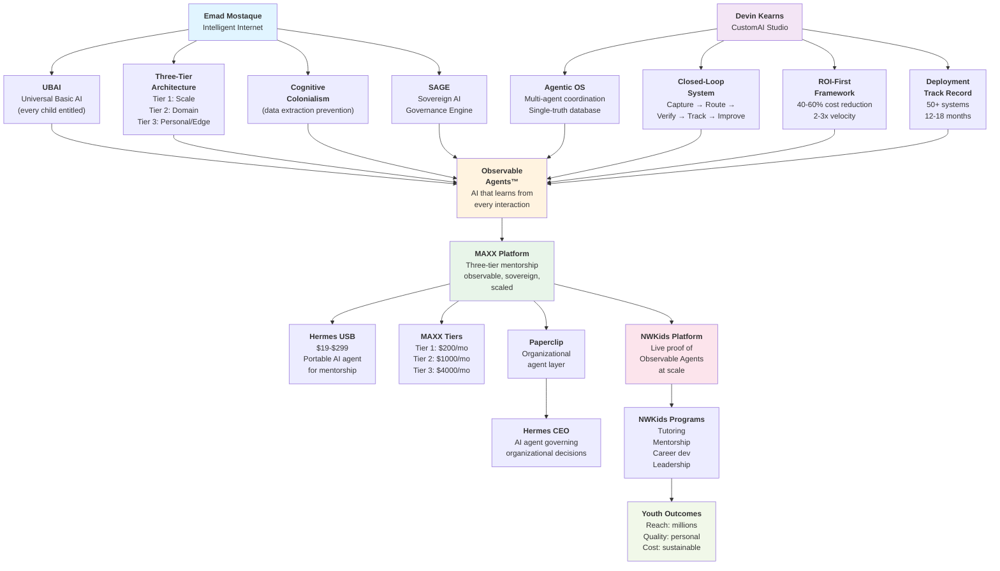

# Observable Agents Concept Map

## Mermaid Diagram: Emad → Devin → NWKids Integration



## Legend & Connections

### Left Path: Emad (Infrastructure Vision)

| Element                   | Meaning                                       | How It Feeds Observable Agents                                                  |
| ------------------------- | --------------------------------------------- | ------------------------------------------------------------------------------- |
| **UBAI**                  | Every child entitled to AI mentorship         | Philosophy: Universal access = our north star                                   |
| **Three-Tier**            | Distributed architecture (no central control) | Design: Tier 3 edge AI for students, Tier 2 for programs, Tier 1 for foundation |
| **Cognitive Colonialism** | Risk of data extraction by centralized powers | Risk mitigation: Observable Agents are transparent, data stays local            |
| **SAGE**                  | Governance model for ethical AI deployment    | Governance: Community boards oversee agent behavior                             |

### Right Path: Devin (Implementation Methodology)

| Element             | Meaning                                      | How It Feeds Observable Agents                                      |
| ------------------- | -------------------------------------------- | ------------------------------------------------------------------- |
| **Agentic OS**      | Multi-agent coordination via single database | Architecture: All mentorship agents coordinate through shared truth |
| **Closed-Loop**     | Capture → Verify → Improve cycle             | Continuous: Agents learn from every match, outcome, conversation    |
| **ROI-First**       | Lead with measurable impact, not hype        | Business model: "More kids reached per dollar" metrics              |
| **50+ Deployments** | Proof that agents work across industries     | Credibility: We're not first-time deployers; we know what works     |

### Center: Observable Agents (The Integration)

**Observable Agents = Emad's vision + Devin's methodology**

- Emad gives us **what** (sovereign, distributed, universal AI)
- Devin shows us **how** (observable, iterative, coordinated agents)
- NWKids applies **where** (youth mentorship, at scale)

### Right: MAXX Platform (The Deployment)

**Three pricing tiers mirror three-tier architecture:**

- **Tier 1 ($200/mo):** Foundational mentorship (text-based AI tutor)
- **Tier 2 ($1,000/mo):** Domain-specialized (career mentors, leadership agents, peer mentors)
- **Tier 3 ($4,000/mo):** Full Observable Agent suite + human mentor coordination

### Edge Cases: Hermes & Paperclip

- **Paperclip** = Organizational agents that coordinate NWKids operations
- **Hermes CEO** = Top-level agent that makes governance decisions (inspired by SAGE but organizational, not policy)
- These enable "AI-augmented nonprofit" structure

### Far Right: Youth Outcomes (The Proof)

- **Reach:** Millions of kids, not thousands
- **Quality:** Each interaction personalized (Tier 3 sovereignty + Tier 2 specialization)
- **Cost:** Sustainable because agents handle 80% of coordination, humans handle 20% of high-value mentorship

---

## How Each Piece Supports NWKids Mission

### Emad's Infrastructure → NWKids Differentiation

- **Claim:** "We're not like Duolingo or Khan Academy"
  - Those extract data, use centralized models
  - We use distributed, sovereign agents
  - Kids own their learning trajectory

### Devin's Methodology → NWKids Sustainability

- **Claim:** "We don't burn out volunteers"
  - Agents handle scheduling, outreach, tracking
  - Volunteers mentor, not administrate
  - CustomAI's 50+ deployments prove it works

### Observable Agents → NWKids Innovation

- **Claim:** "We're building a new category of mentorship"
  - Not AI replacing mentors (bad)
  - Not humans managing logistics (inefficient)
  - But: **Humans mentoring, agents observing and amplifying**

### MAXX Tiers → NWKids Revenue Model

- **Claim:** "We scale sustainably"
  - Tier 1: Reach scale (low-cost, high-volume)
  - Tier 2: Deepen impact (specialized mentorship)
  - Tier 3: Premium services (full suite for committed orgs)

---

## Graph as Decision Tree

**Question: What do we build first?**

```
Start: How many kids do we serve?
├─ <10,000 (early stage)
│  └─ Build Tier 3: Full observable agent suite
│     └─ Learn closed-loop, understand user needs
│     └─ Create case studies
│
├─ 10,000-100,000 (scaling)
│  └─ Build Tier 2: Domain-specialized agents
│     └─ Career mentorship, leadership development
│     └─ Add customization per sector
│
└─ >100,000 (global)
   └─ Build Tier 1: Foundational layer
      └─ Basic tutoring, mentorship matching
      └─ Leverage open-source models (Intelligent Internet compatible)
      └─ Maximize reach, minimize cost
```

---

## The Three Circles: Where NWKids Lives

```
        Emad's Vision
      (Sovereign AI for All)
      /                  \
    /                      \
  /----- Observable ---------\
 /       Agents™              \
/        (MAXX)                \
|                              |
|      NWKids Platform         |
|   (Live Implementation)      |
|                              |
\                            /
 \     Devin's Methodology   /
  \   (Agentic OS Deployed) /
   \                       /
    \                     /
     (Impact at Scale)
```

Where the three circles intersect = NWKids' unique position:

1. **Emad's credibility** (infrastructure thinker) validates our vision
2. **Devin's proof** (50+ deployments) validates our model
3. **NWKids' mission** (youth outcomes) validates our purpose

---

## Roadmap Visualization

```
2026 Q2-Q3: Research & Design
├─ Integrate Intelligent Internet research
├─ CustomAI partnership discussions
└─ Observable Agents specification

2026 Q4: Prototype (Tier 3)
├─ Build observable agent for mentorship matching
├─ Deploy with 100 volunteer mentors
├─ Test closed-loop improvement
└─ Measure outcomes vs. baseline

2027 Q1-Q2: Scale (Tier 2)
├─ Add domain-specialized agents (career, leadership, academic)
├─ 10x mentors, 1000 kids
├─ Incorporate Intelligent Internet Tier 2 architecture
└─ Publish case study

2027 Q3-Q4: Distribute (Tier 1)
├─ Open-source foundational models
├─ Reach 100,000+ kids globally
├─ Adopt SAGE governance principles
└─ License to other nonprofits

2028+: Ecosystem
├─ Observable Agents becomes platform
├─ Other organizations build on it
├─ Hermes-level governance agents deployed
└─ "Universal Basic Mentorship" framework adopted internationally
```

---

## Sources & Attribution

- **Emad Mostaque Vision:** Intelligent Internet (II.inc), Cognitive Revolution podcast (Dec 2024)
- **Devin Kearns Methodology:** CustomAI Studio, LinkedIn posts, 50+ deployment case studies
- **NWKids Synthesis:** Internal strategy + this research integration
- **Visualization Built:** June 2026

---

## Next Steps

1. **Validate with Emad:** Does this diagram accurately represent Intelligent Internet + UBAI vision?
2. **Validate with Devin:** Does this accurately represent CustomAI's agentic OS approach?
3. **Iterate:** Update diagram based on feedback
4. **Use as tool:** Present to board, donors, partners as "this is what we're building"
